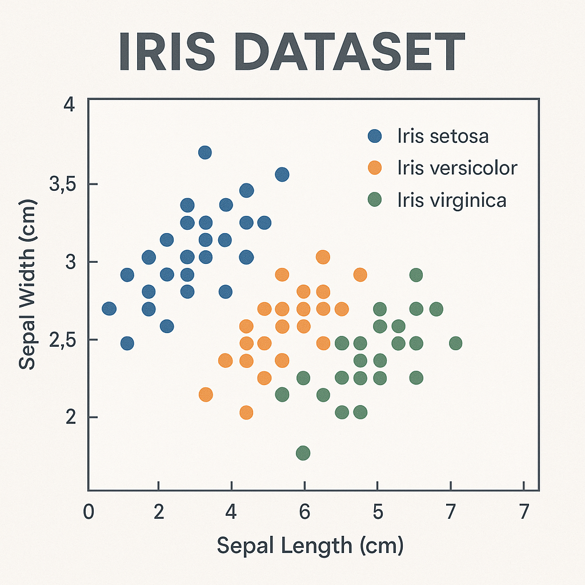

# Iris Dataset



O Iris Dataset é uma das bases de dados mais clássicas e utilizadas na área de ciência de dados e aprendizado de máquina. Ele contém 150 amostras de flores do gênero Iris, divididas igualmente entre três espécies: Iris setosa, Iris versicolor e Iris virginica.

Cada amostra possui quatro atributos numéricos:

- Comprimento da sépala (sepal length)

- Largura da sépala (sepal width)

- Comprimento da pétala (petal length)

- Largura da pétala (petal width)

O objetivo principal deste dataset é a classificação de espécies com base nas medidas das flores. Este projeto inclui:

- Análise exploratória dos dados (EDA)

- Visualizações informativas com foco em separabilidade entre espécies

- Aplicação de modelos de classificação

- Avaliação de desempenho com métricas como acurácia, precisão e matriz de confusão

## Organização do projeto

```
├── .gitignore         <- Arquivos e diretórios a serem ignorados pelo Git
├── environment.yml    <- O arquivo de requisitos para reproduzir o ambiente de análise
├── LICENSE            <- Licença de código aberto se uma for escolhida
├── README.md          <- README informações pertinentes sobre o projeto.
|
├── dados              <- Arquivos de dados para o projeto.
|
├── modelos            <- Modelos treinados e serializados, previsões de modelos ou resumos de modelos
|
├── notebooks          <- Cadernos Jupyter. A convenção de nomenclatura é um número (para ordenação),
│                         as iniciais do criador e uma descrição curta separada por `-`, por exemplo
│                         `01-sr-exploracao-inicial-de-dados`.
│
|   └──src               <- Código-fonte para uso neste projeto.
|      │
|      ├── __init__.py   <- Torna um módulo Python
|      ├── auxiliares.py <- Funções auxiliares para organização do código.
|      ├── config.py     <- Configurações básicas do projeto.
|      ├── graficos.py   <- Scripts para criar visualizações exploratórias e orientadas a resultados.
|      └── models.py     <- Modelos que foram utilizados no projeto.
|
├── referencias          <- Dicionários de dados, manuais e todos os outros materiais explicativos.
|
├── imagens         
│      |
|      └── iris_dataset_image.png <- Imagem ilustrativa para o projeto.
```

## Configuração do ambiente

1. Faça o clone do repositório que será criado a partir deste modelo.

    ```bash
    git clone https://github.com/SamuelRibeiro9/01_Iris_classifier.git
    ```

2. Crie um ambiente virtual para o seu projeto utilizando o gerenciador de ambientes de sua preferência.

    a. Caso esteja utilizando o `conda`, exporte as dependências do ambiente para o arquivo `environment.yml`:

      ```bash
      conda env create -f environment.yml --name iris_classifier
      ```

    b. Caso esteja utilizando outro gerenciador de ambientes, exporte as dependências
    para o arquivo `requirements.txt` ou outro formato de sua preferência. Adicione o
    arquivo ao controle de versão, removendo o arquivo `environment.yml`.

## Informações sobre o dataset

[Clique aqui](referencias/01_dicionario_de_dados.md) para ver o dicionário de dados. 
